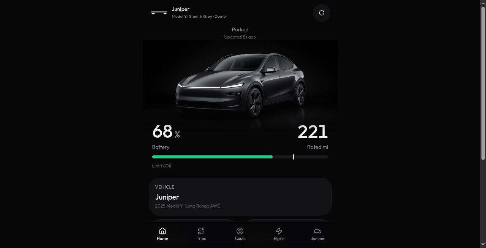
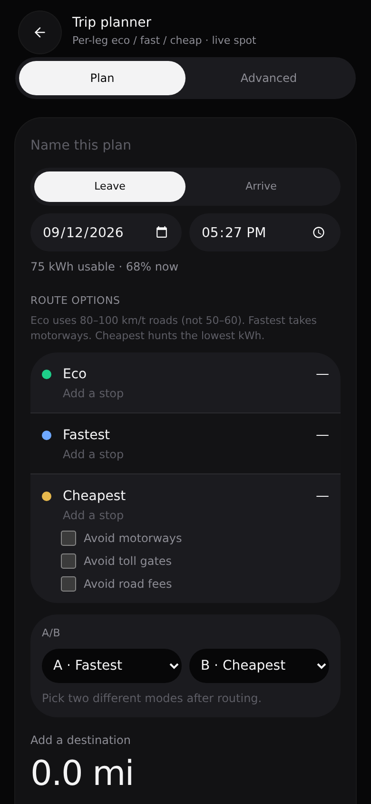
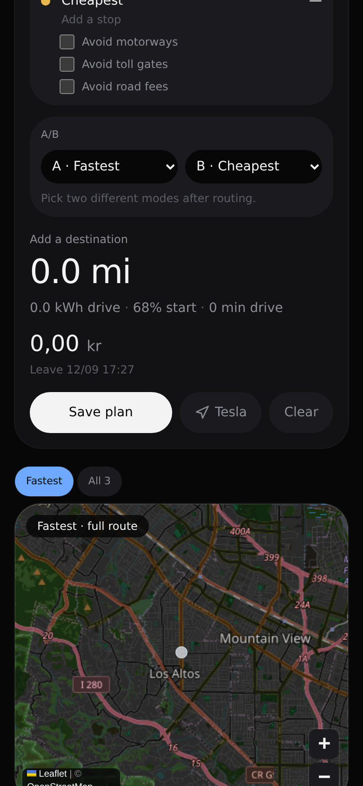
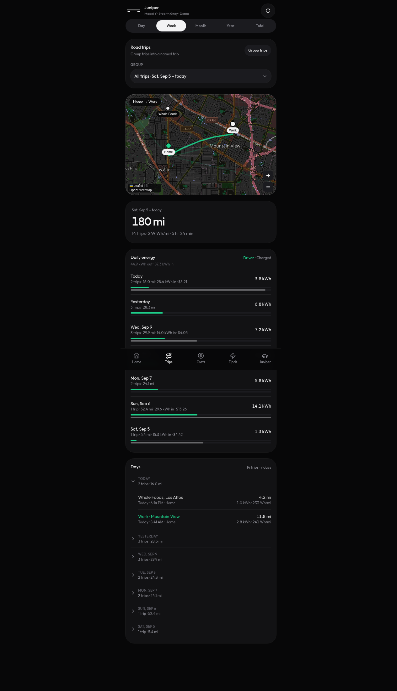
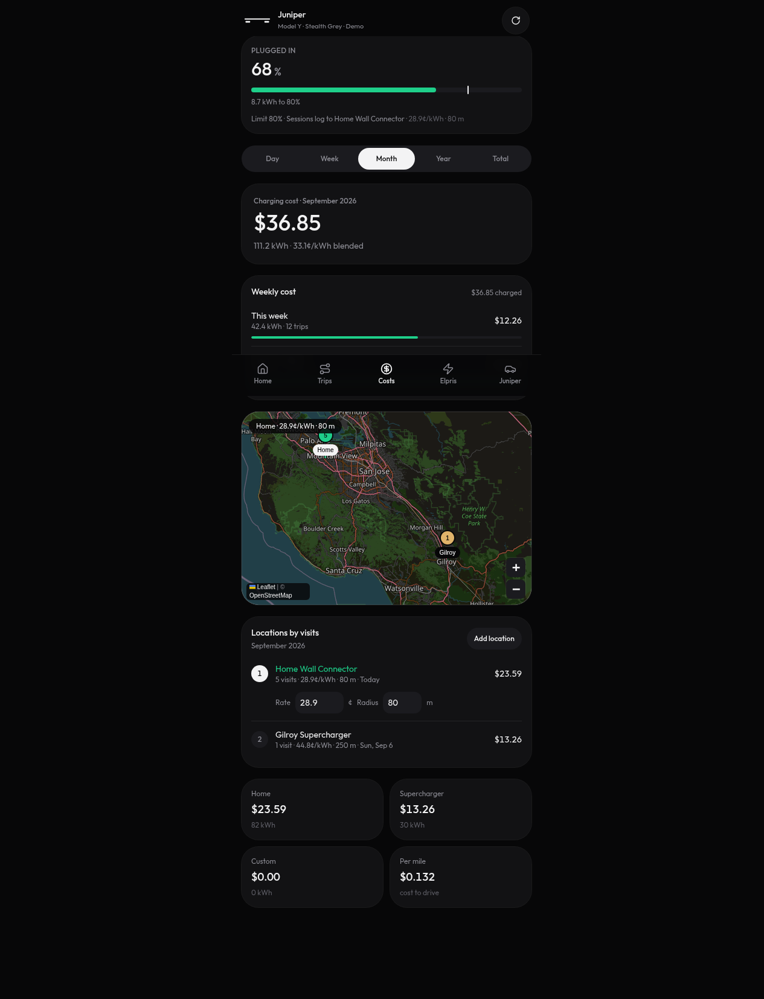
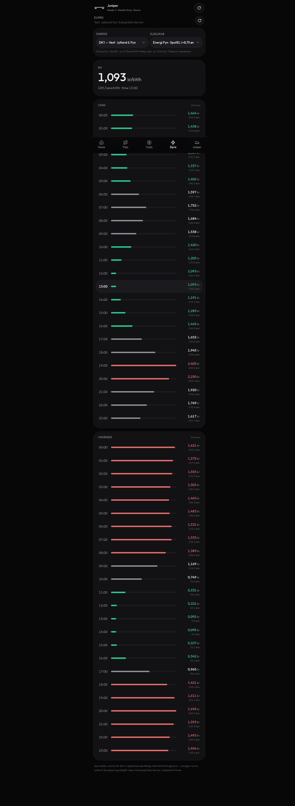
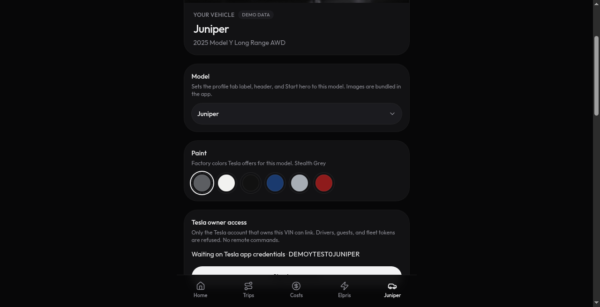
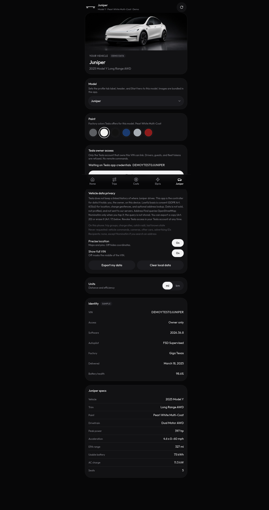

# tesla_trip

A dark, mobile-first companion for Tesla ownership — trips, charging costs, Danish spot electricity (`Elpris`), a local vehicle catalog, and an EV trip planner with eco / fastest / cheapest corridors.

Demo data ships out of the box. Owner-only Tesla linking is scaffolded; nothing remote is commanded.



---

## Features

### Home
At-a-glance status for the selected car: parked/driving, battery %, rated range, charge limit, and the local hero image for the current model + paint.

- Odometer, charged energy, regen, and vs-petrol savings tiles
- Charge limit marker on the battery bar
- Header + bottom tab follow the selected model name
- Link into the trip planner (`/plan`)

### Trip planner
Plan a drive with three independent corridors. Opened from Home (or Trips) at [`/plan`](/plan).



- **Eco** — 80–100 km/t roads, avoids motorways and tolls when it can
- **Fastest** — motorway corridor, time first, tolls allowed
- **Cheapest** — same roads as Fastest unless you toggle avoid motorway / toll / road fee; hunts cheaper stalls (max ~15 km extra per leg)
- Leave or arrive clock (date + time); wait only counts when a cheap slot actually delays you
- Charge when SOC would drop under 25% (never below 8%); typical fill to 80%
- Suggested optional charge in the 26–45% band when the price is good
- EU charging networks + OpenChargeMap along the polyline; live Elpris for kWh cost
- Save / load named plans (default name from start → end) and export to Tesla nav



### Trips
Period filters (Day / Week / Month / Year / Total) with maps, energy charts, and expandable day/week/year subgroups.



- Road-trip albums you can name and date-range
- Leaflet map of the selected period (OpenStreetMap)
- Drive cost, energy, time, and places summary
- Expand a day (or week/year bucket) to see individual trips

### Costs
Charging spend broken down by Home, Supercharger, and Custom locations — with editable rates and catch radius.



- Plugged-in session card with kWh to limit
- Period pills aligned with Trips
- Map pins for charge locations (visit counts)
- Always-visible **Home · Supercharger · Custom · Per mile** tiles
- Add custom places (address search or map pin) and set ¢/kWh + geofence radius

### Elpris
Live Danish day-ahead spot prices from Energi Data Service, plus retailer tillæg.



- Region switch: **DK1** (Vest) / **DK2** (Øst)
- Elselskab dropdown (spot + Danish retailers with tillæg)
- Current hour card + Today / Tomorrow hour lists
- Color-tinted bars for cheap → expensive hours

### Vehicle profile
Pick the Tesla model and factory paint. Tab label, header, document title, and Start hero all follow the selection. Images are bundled under `public/vehicles/`.





- Models: Juniper, Highlander, Model Y, Model 3, Model S, Model X, Cybertruck
- Factory paint swatches per model (pose-locked front/rear JPG heroes)
- Tesla owner-access scaffold (demo VIN; no remote commands)
- Privacy controls: precise location, show VIN, export / clear local data
- Units: mi / km

---

## Vehicle catalog

Local studio heroes — same front ¾ pose across paints within each model.

| Juniper | Highlander | Model Y | Model 3 |
|:---:|:---:|:---:|:---:|
|  |  |  |  |

| Model S | Model X | Cybertruck |
|:---:|:---:|:---:|
|  |  |  |

Paint assets live at:

```text
public/vehicles/{modelId}-{paintId}-{front|rear}.jpg
```

---

## Tabs

| Tab | Route | What it does |
| --- | --- | --- |
| Home | `/` | Status, hero, battery & range |
| Trips | `?tab=trips` | Driving history, maps, road trips |
| Costs | `?tab=costs` | Charge spend & locations |
| Elpris | `?tab=elpris` | DK spot + retailer prices |
| Profile | `?tab=vehicle` | Model, paint, privacy, specs |
| Trip planner | `/plan` | Eco / fastest / cheapest route + chargers |

The profile tab label is the selected model name (e.g. **Juniper**).

---

## Stack

- **UI:** React 19, TanStack Router/Start, Tailwind CSS 4, Zustand
- **Maps:** Leaflet + OpenStreetMap
- **Routing:** OSRM / Valhalla alternatives, OpenChargeMap along the polyline
- **Prices:** Energi Data Service (DK1/DK2 day-ahead) + EU network catalog
- **Data:** Local/demo vehicle + trip/charge stores (PGlite migrations available)

---

## Run locally

```bash
npm install
npm run dev
```

Dev server defaults to [http://localhost:8080](http://localhost:8080). Open [`/plan`](http://localhost:8080/plan) for the trip planner.

```bash
npm run typecheck
npm test
npm run build
```

---

## Privacy (demo)

- Trip and charge data stay on-device in this demo build
- Address find uses OpenStreetMap Nominatim only when you tap it
- Planner charger search uses OpenChargeMap along the chosen route
- Export / clear local data from the Vehicle tab
- Tesla owner linking is scaffolded for demos — no remote vehicle commands

---

## Screenshots

Source PNGs for this README live in [`docs/readme/`](docs/readme/).
