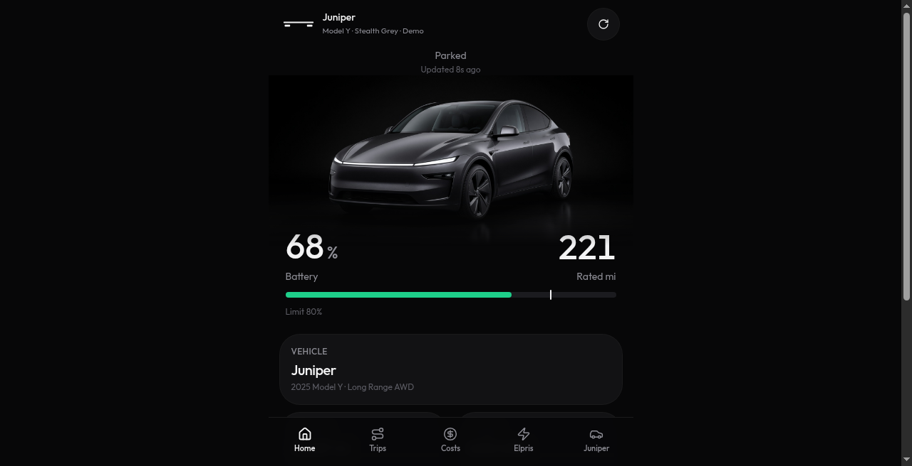
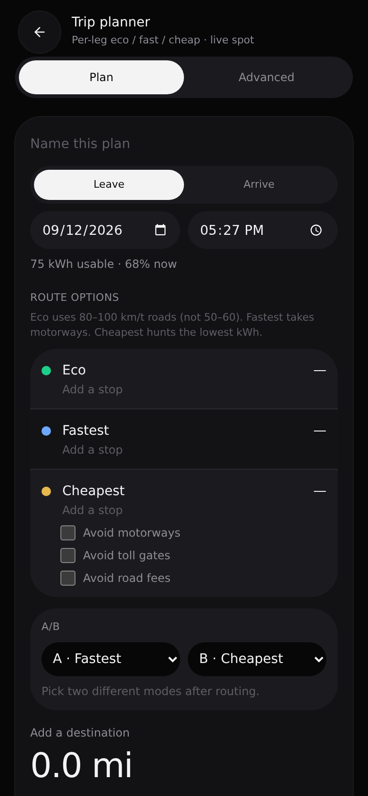
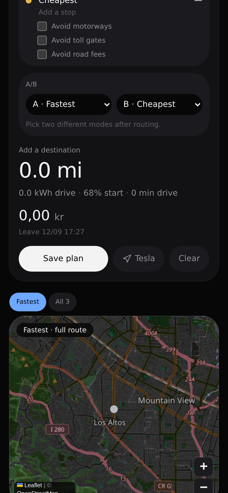
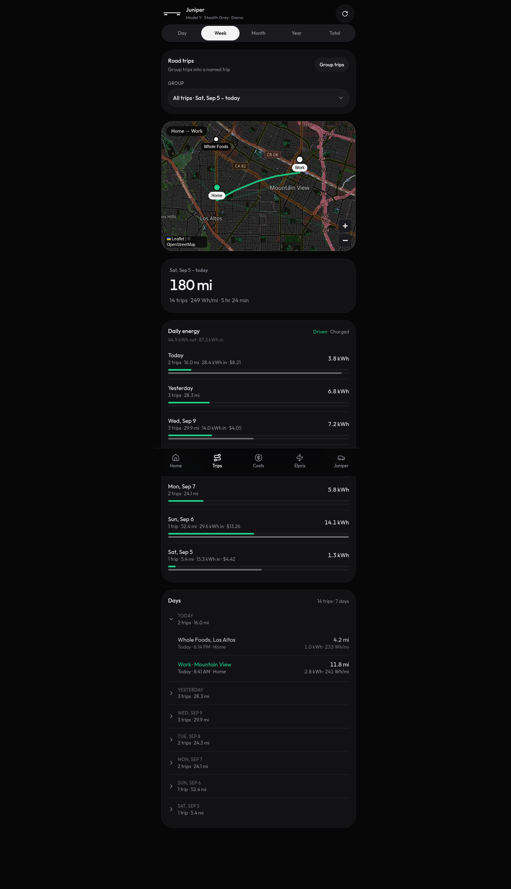
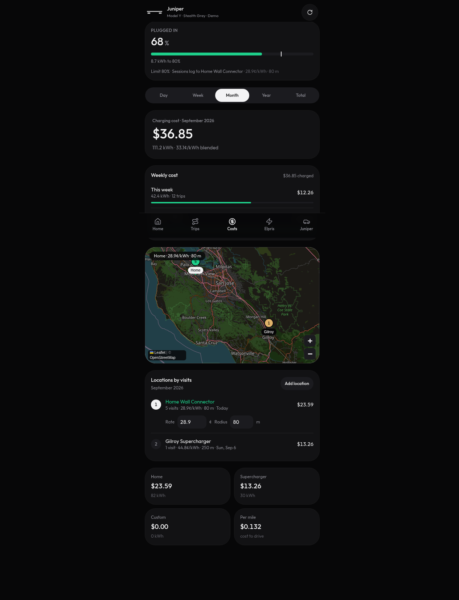
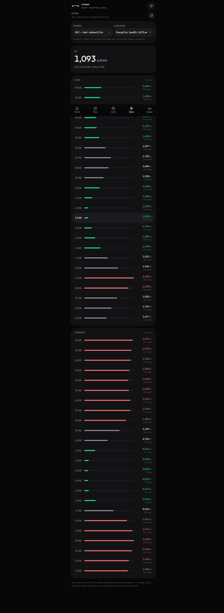
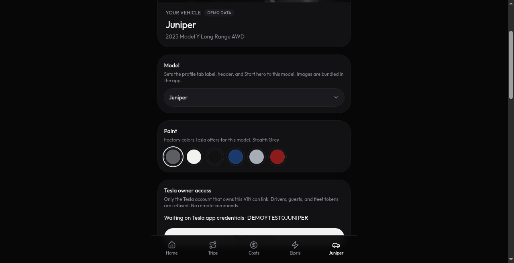
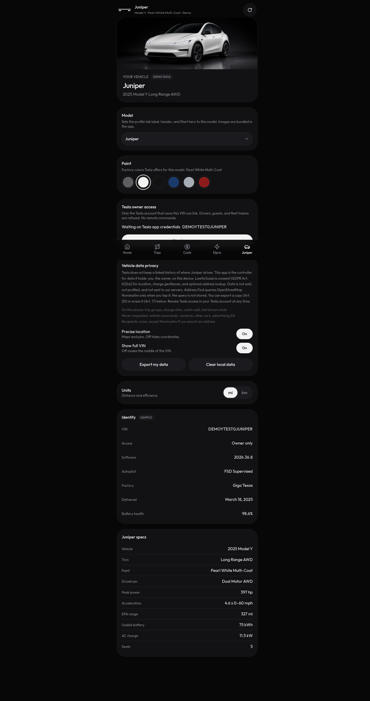

# tesla_trip

A dark, mobile-first companion for a Tesla: trips, charging costs, Danish spot prices, a local vehicle catalog, and an EV trip planner.

Demo data is included. Tesla linking is owner-only and local. The app does not send remote commands.



---

## Features

### Home
Status for the selected car: parked or driving, battery, rated range, and the hero for the current model and paint.

- Odometer, charged energy, regen, and vs-petrol savings
- Charge-limit marker on the battery bar
- Header and the profile tab use the selected model name
- Opens the trip planner at [`/plan`](/plan)

### Trip planner
Three corridors for the same stops. Open it from Home or go to [`/plan`](/plan).

The planner has three panes. **Plan** is the trip. **Advanced** is the car and the search radius. **Memberships** is which networks you pay for. A membership applies to every pane.



**Stops.** Add a stop at the top. Tap a stop to change the address. The first stop gets a leave time; later stops stay on Auto until you set leave or arrive. A later arrival time moves the start leave back by the drive time. Tap the time note to edit it.

**Routes.** Eco, Fastest, and Cheapest stay independent. Expand a mode to see every stop, including each charge as its own via with kWh and price.

| Mode | What it optimizes |
| --- | --- |
| Eco | 80–100 km/t roads. Uses a highway when it is the sensible road, not a motorway by default. A route about twice as slow as Fastest is penalized. |
| Fastest | Motorways and the shortest time. Tolls and road fees are allowed. If you prefer a network, Fastest uses only that network. |
| Cheapest | Lowest charging price inside the search radius. Stays on the preferred network unless another stall in that radius is actually cheaper. Avoid motorways, tolls, or road fees with the toggles on this row. |

**Charging.** A stop is required if arrival would fall under 25%, and the plan never arrives below 8%. A normal fill goes to 80%. An optional stop in the 26–45% band is suggested only when the price is good and it adds at least 20%.

**Preferred network.** Pick one network you already subscribe to. Fastest will not substitute another brand. Cheapest starts there and leaves it only for a better price in the search area.

**Advanced.** Set usable battery kWh, a general kWh/mi, and the state of charge for this plan only. Charge-search distance is shared by the modes. Per-speed consumption (50 / 80 / 110 / 130 km/t) is in kWh/100 km. `kWh/mi = (kWh/100 km) × 0.0161`.

**In and out.** Paste a Google Maps or Apple Maps link to import stops. Export the edited trip back to Google Maps, Apple Maps, or Tesla nav. Save uses “start → end” until you rename it, and stores the start date, total time, and cost. Clear asks before it wipes the draft. Saved plans can be opened again or filed under Trips.



### Trips
Day, week, month, year, and total. Each period nests into the one below it: years, then months, then weeks, then days.



- Named road-trip albums, including a start and end date instead of picking every drive
- Map of the selected period
- Drive cost, energy, time, and places
- A day, week, or year opens to the trips inside it

### Costs
Home, Supercharger, and custom locations, with your own rate and a catch radius.



- Session card while plugged in
- Same period pills as Trips
- Pins ranked by how often you charge there
- Add a place by address or by dropping a pin, then set the price and radius
- A logged session inside that radius is counted there

### Elpris
Danish day-ahead prices from Energi Data Service, plus the retailer tillæg.



- **DK1** (west) or **DK2** (east)
- Elselskab list: spot and retailers with tillæg
- This hour, today, and tomorrow
- Hours that have already passed are dimmed; tomorrow starts collapsed

### Vehicle
The model and paint you pick change the tab name, the header, and the Home hero. Images are in `public/vehicles/`.





- Juniper, Highlander, Model Y, Model 3, Model S, Model X, Cybertruck
- Factory paints, with a matched front and rear hero
- Owner-access scaffold only. Demo VIN, no remote commands
- Precise location, show VIN, export or clear local data
- Miles or kilometres

---

## Vehicle catalog

Same front three-quarter pose for every paint of a model.

| Juniper | Highlander | Model Y | Model 3 |
|:---:|:---:|:---:|:---:|
|  |  |  |  |

| Model S | Model X | Cybertruck |
|:---:|:---:|:---:|
|  |  |  |

```text
public/vehicles/{modelId}-{paintId}-{front|rear}.jpg
```

---

## Tabs

| Tab | Route | What it does |
| --- | --- | --- |
| Home | `/` | Status, hero, battery, range |
| Trips | `?tab=trips` | History, map, road trips |
| Costs | `?tab=costs` | Spend and charge places |
| Elpris | `?tab=elpris` | DK spot and retailer prices |
| Profile | `?tab=vehicle` | Model, paint, privacy |
| Trip planner | `/plan` | Plan, Advanced, Memberships |

The profile tab is named after the selected model, for example **Juniper**.

---

## Stack

- **UI:** React 19, TanStack Router/Start, Tailwind CSS 4, Zustand
- **Maps:** Leaflet and OpenStreetMap
- **Routing:** OSRM and Valhalla. Chargers from OpenChargeMap along the polyline
- **Prices:** Energi Data Service (DK1/DK2) and a catalog of EU networks, including site rates where they vary by hour
- **Data:** On-device demo stores. PGlite migrations are available

---

## Run locally

```bash
npm install
npm run dev
```

The dev server is [http://localhost:8080](http://localhost:8080). The planner is [http://localhost:8080/plan](http://localhost:8080/plan).

```bash
npm run typecheck
npm test
npm run build
```

`npm test` includes the regression cases. Each one was added after a real failure, and it fails again if that bug returns.

| Case | What it catches |
| --- | --- |
| Fastest inserts one charger and bills that stall | A long hop arriving under 25% with no stop, or a chain of every stall on the motorway |
| A hop into Spain charges in Spain | Charger search that dies after the first 280 km, or seeds that stop at Lyon |
| Corridor split keeps the last point | A Spain or other far end left out of the OpenChargeMap request |
| Long distance is great-circle kilometers | A flat shortcut on a long hop, or kilometers labeled as miles |
| Edge cases | Zero length, the date line, a route too short to split, 25% battery, and empty number fields |
| Keeps a Tesla on the whole route | Same check for Svendborg–Barcelona, Oslo–Rome, Amsterdam–Madrid, Hamburg–Budapest, and Copenhagen–Milan |
| Service worker cache is versioned | A page load that waits forever on the network |
| Leaflet map loads without an idle wait | The map chunk, CARTO tiles, and preconnect start immediately instead of after two 600 ms idle delays |

---

## Privacy

Trip and charge data stay on this device in the demo build. Address search calls Nominatim only when you search. Charger search calls OpenChargeMap only for the route you are planning. Export or clear everything from the Vehicle tab. Nothing here starts, stops, or unlocks the car.

Screenshots live in [`docs/readme/`](docs/readme/).
